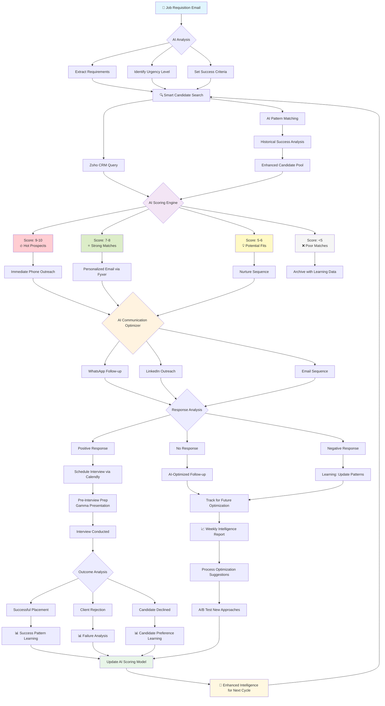

```mermaid
graph TD
    A[📧 Job Requisition Email] --> B{AI Analysis}
    B --> C[Extract Requirements]
    B --> D[Identify Urgency Level]
    B --> E[Set Success Criteria]
    
    C --> F[🔍 Smart Candidate Search]
    D --> F
    E --> F
    
    F --> G[Zoho CRM Query]
    F --> H[AI Pattern Matching]
    H --> I[Historical Success Analysis]
    I --> J[Enhanced Candidate Pool]
    
    G --> K{AI Scoring Engine}
    J --> K
    
    K --> L[Score: 9-10<br/>🔥 Hot Prospects]
    K --> M[Score: 7-8<br/>⭐ Strong Matches]  
    K --> N[Score: 5-6<br/>💡 Potential Fits]
    K --> O[Score: <5<br/>❌ Poor Matches]
    
    L --> P[Immediate Phone Outreach]
    M --> Q[Personalized Email via Fyxer]
    N --> R[Nurture Sequence]
    O --> S[Archive with Learning Data]
    
    P --> T{AI Communication Optimizer}
    Q --> T
    R --> T
    
    T --> U[WhatsApp Follow-up]
    T --> V[LinkedIn Outreach]
    T --> W[Email Sequence]
    
    U --> X{Response Analysis}
    V --> X
    W --> X
    
    X --> Y[Positive Response]
    X --> Z[No Response]
    X --> AA[Negative Response]
    
    Y --> BB[Schedule Interview via Calendly]
    Z --> CC[AI-Optimized Follow-up]
    AA --> DD[Learning: Update Patterns]
    
    BB --> EE[Pre-Interview Prep<br/>Gamma Presentation]
    CC --> FF[Track for Future Optimization]
    DD --> FF
    
    EE --> GG[Interview Conducted]
    GG --> HH{Outcome Analysis}
    
    HH --> II[Successful Placement]
    HH --> JJ[Client Rejection]
    HH --> KK[Candidate Declined]
    
    II --> LL[📊 Success Pattern Learning]
    JJ --> MM[📊 Failure Analysis]
    KK --> NN[📊 Candidate Preference Learning]
    
    LL --> OO[Update AI Scoring Model]
    MM --> OO
    NN --> OO
    
    OO --> PP[🧠 Enhanced Intelligence for Next Cycle]
    PP --> F
    
    FF --> QQ[📈 Weekly Intelligence Report]
    QQ --> RR[Process Optimization Suggestions]
    RR --> SS[A/B Test New Approaches]
    SS --> OO
    
    style A fill:#e1f5fe
    style K fill:#f3e5f5
    style T fill:#fff3e0
    style OO fill:#e8f5e8
    style PP fill:#fff8e1
    
    classDef hotLead fill:#ffcdd2
    classDef goodLead fill:#dcedc8  
    classDef nurture fill:#fff9c4
    classDef archive fill:#f5f5f5
    
    class L hotLead
    class M goodLead
    class N nurture
    class O archive
```
